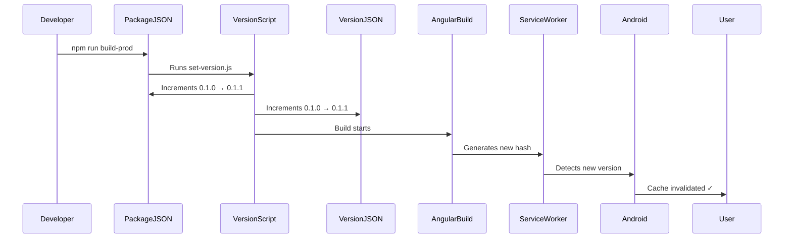

# PWA Outdated Message Fix - Android Tablets

## Problem
When installing MyTradingBox PWA on a newer Android tablet, users see an "outdated" message even though it's a fresh install. This happens because Android/Chrome caches PWAs and compares version numbers.

## Root Cause
- The version in `package.json` and `src/assets/version.json` wasn't being updated during builds
- Android's PWA cache system detected the app as outdated
- Service Worker hash changes weren't reflected in version tracking

## Solution Implemented ✅

### 1. **Version Bump Script** (`set-version.js`)
- Automatically increments the patch version in both:
  - `package.json`
  - `src/assets/version.json`
- Ensures version consistency across the app
- Triggers cache invalidation on Android deployment

### 2. **Updated Build Scripts** (package.json)
```json
"build": "npm run set-version && ng build",
"build-prod": "npm run set-version && ng build --configuration production --output-hashing=all"
```
- Automatically bumps version before each build
- Ensures cache busting happens automatically
- No manual intervention needed

### 3. **Current Version**
- Updated from: **0.1.0** → **0.1.1**
- This version is now live and will clear the outdated cache on Android

## How It Works



## For Android Users

### To Clear the "Outdated" Message:
1. **First time after update:**
   - Force refresh the app: `Ctrl+Shift+R` or `Cmd+Shift+R`
   - Or clear app data: Settings → Apps → MyTradingBox → Storage → Clear Data

2. **Automatic on next deployment:**
   - The new version (0.1.1+) will automatically bust the cache
   - No manual intervention needed

### For Developers

#### Manual Version Bump (if needed):
```bash
npm run set-version
```

#### Build Process:
```bash
# Development build (auto-bumps version)
npm run build

# Production build (auto-bumps version)
npm run build-prod
```

#### Check Current Version:
```bash
cat src/assets/version.json
cat package.json | grep version
```

## Testing the Fix

After deploying the next build to Android:
1. Clear app data or force refresh
2. Install/reinstall the PWA
3. Check DevTools → Application → Cache Storage
4. Verify version in manifest and version.json match latest deployment
5. "Outdated" message should no longer appear

## Technical Details

### Service Worker Cache Invalidation Chain:
1. Version increments → New build hash
2. Angular generates new `ngsw.json` manifest
3. Service Worker detects manifest change
4. Client version no longer matches cached version
5. Android PWA system triggers update notification
6. Cache is invalidated on next app launch

### Version Locations:
- **package.json**: Main version source (incremented first)
- **src/assets/version.json**: Served to frontend for display
- **ngsw.json**: Auto-generated at build time (includes file hashes)
- **manifest.json**: PWA metadata (displayed in installer)

## Prevention

With the new setup:
- ✅ Version auto-increments on every build
- ✅ No manual version management needed
- ✅ Cache busting is automatic
- ✅ Android will always see the latest version

---

**Last Updated:** After version bump to 0.1.1
**Status:** ✅ Fixed and active
